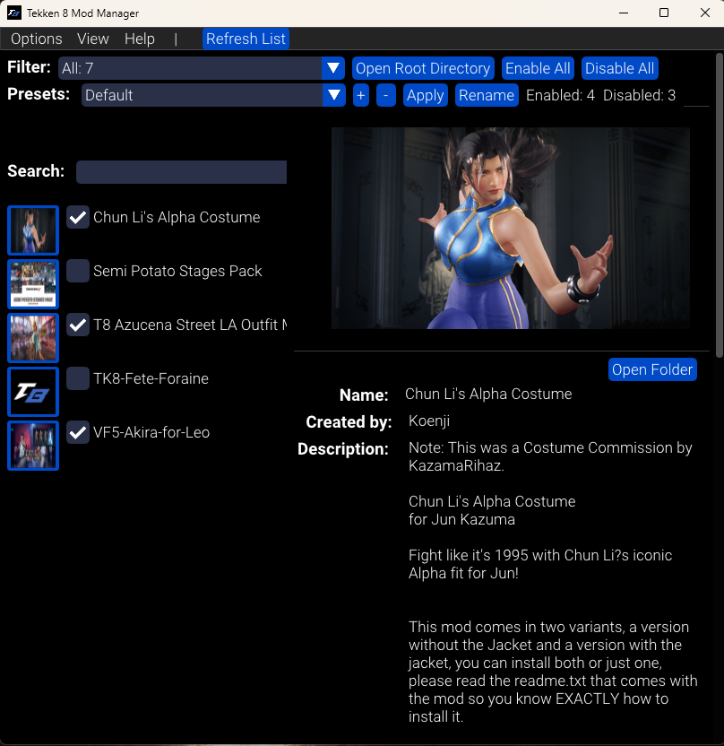
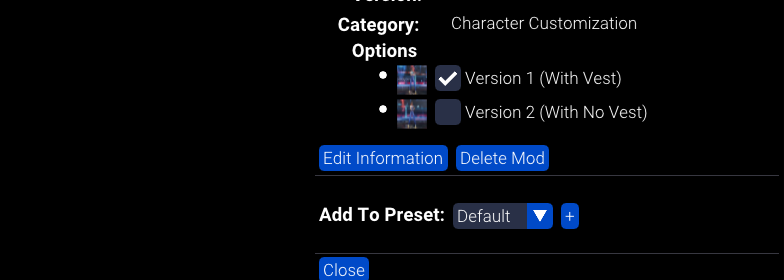
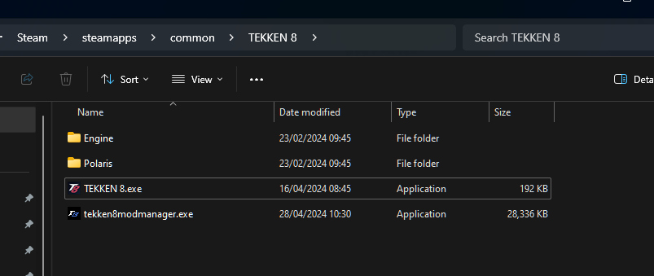
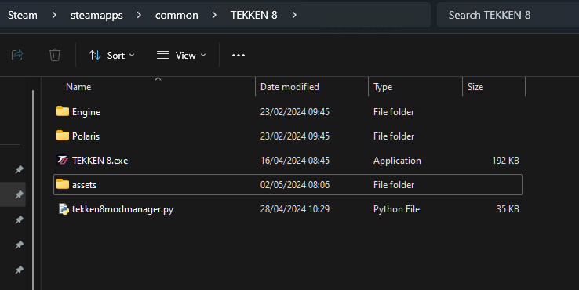
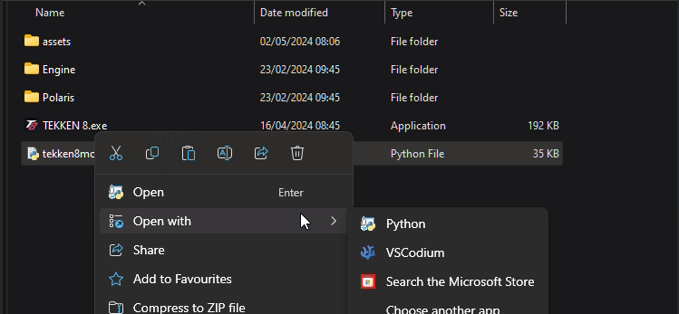

 

&nbsp;

### Index

----
1. [Description](#Description)
2. [Updates](#Latest-Update)
3. [How It Works](#How-It-Works)
4. [Instructions](#Installation)
5. [Know Issues](#Know-Issues)
6. [FAQ](#FAQ)
7. [Credits](#Credits)

&nbsp;

### Description
----
An open sourced mod manager inspired by [CCDTreborn's 8 Mod On / Off Switch (Version 2)](https://tekkenmods.com/mod/3312/tekken-8-mod-on-off-switch-version-2) to enable/disable your mods with a switch.

 

Source code: [https://github.com/opensource111111/tekken-8-mod-manager](https://github.com/opensource111111/tekken-8-mod-manager)

&nbsp;

### Latest Updates

----

2.3.1
#### 29th July 2024
    
- Added an encoding flag "encoding="utf-8" to the function that creates the mod.ini for newly added mods. It should fix the encoding issue. If this is still happening then please let me know in the comments.

- Fixed an issue with some special characters crashing the program when typed in the search bar. If this is still happening then please let me know in the comments.

#### 26th July 2024

 - Added fallbacks for all the options in the mod.ini if for some reason an option is missing or if you misspelled it while editing the mod.ini manually. 

#### 24th July 2024

- Fixed issue with presets. AttributeError: 'Configs' object has no attribute 'font_colour'

#### 22nd July 2024

- Fixed error with mod ini file throwing error for "is_sub_mod".

#### 17th July 2024
- The program no longer needs to reimport the list of mods into the program when deleting mods.
- Added website links to Tekken mods websites under the "Help" tab at the top of the window. 

2.3
#### 11th July 2024
- Reformed the ini file for mods.
- Reformed the ini file for the program.
- Separated the fonts for the programs text body, title and headers. You can now change the size, font and colour for each.
- The ability to group sub mods under the main mod. For example, [Chun Li Alpha Costume](https://tekkenmods.com/mod/4352/chun-li-s-alpha-costume) and [Vindictus dress](https://tekkenmods.com/mod/4218/vindictus-dress). To use this, open to the details panel of the mod of your choice and click the edit information button. Near the bottom you will see the header called options. Click the + sign which will add a text field and type the absolute name of the mod you want to be added as a sub mod. The mods you add will now only show under the options header on the mod. To remove the mod just click the - sign in the details panel.

 

Changelog History: https://github.com/opensource111111/tekken-8-mod-manager/blob/main/changelog.md

&nbsp;

### How It Works

----
[Manual here.](doc/manual.md)

- The program searches for folders/subfolders inside "Steam\steamapps\common\Tekken 8\Polaris\Content\Paks" that have .pak files inside on them and then lists them inside the program to then be able to switch them on/off. 

- The program adds or removes "-x" at the end of each file (.utoc, .ucas, .pak) to enabled/disabled.
	
   - Enabled = Filenames not ending with "-x"
   - Disabled = Filenames ending with "-x"

- Please read the mod creators instruction on how to install there mod. The mod need to have its own separate folder. By doing this you can turn on/off mods separately.

   examples: 

   

&nbsp;

### Installation

----
   
   #### Option 1: Run from executable. (Windows Only)

   1. Unzip the exe file from the zip file. You will most likely get a virus warning which will then quarantine the file. Any virus warning you may have are false positives. 

   2. Place the executable in "Steam\steamapps\common\Tekken 8" and run.
   
   
   

   Note: The Windows executable was compiled using pyinstaller.
      
        pyinstaller tekken8modmanager.spec

   #### Option 2: Run from script (Windows / Linux)

      
   1.  Windows  -  Install Python 3.11.9: https://www.python.org/downloads/release/python-3119/
   2.  Linux  - Open Terminal / Windows - Open Windows command prompt and install required packages using these commands below.

            - pip install pip
            - pip install glfw=2.7.0
            - pip install numpy=1.26.4
            - pip install PyOpenGL=3.1.7
            - pip install PyOpenGL_accelerate
            - pip install imgui=2.0.0
            - pip install pillow=10.3.0

         
   3. Place the "tekken8modmanager.py" script and "assets" folder inside "Steam\steamapps\common\Tekken 8".
     

   

   
    Windows  - Right click file to open the context menu and open with 
   Python.

   

    Linux  - Open the python terminal and type "python3". Drag and drop 
   the script onto the terminal and press enter.

      python3 path_to_script

&nbsp;

 ### Known Issues

----

-

&nbsp;

### FAQ

----

- Q = Am i making any videos for the mod manager ?
   - A = Manual here: [Manual here.](docs/manual.md)

- Q = Can you create mods with this program ?
   - A = No. This programs purpose is to help organise your mod collection.

&nbsp;

### Credits:

----

glfw:  https://pypi.org/project/glfw/

numpy: https://github.com/numpy/numpy

PyOpenGL: https://pypi.org/project/PyOpenGL/

imgui: https://pypi.org/project/imgui/

pillow: https://pypi.org/project/pillow/

TARGET FONT BY Iconian Fonts : https://www.fonts4free.net/tarrget-font.html#

