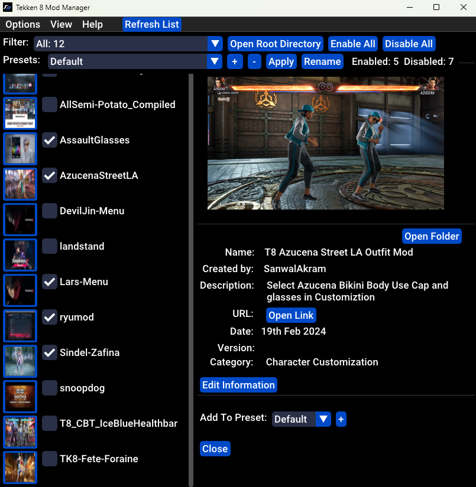
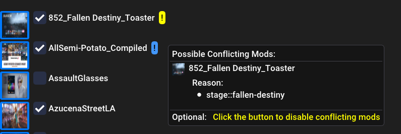
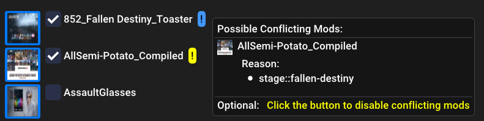
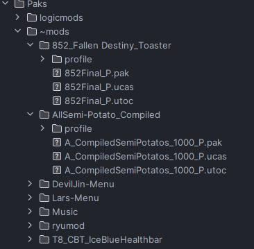
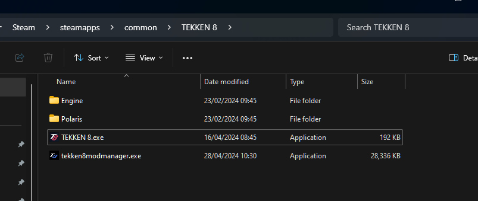
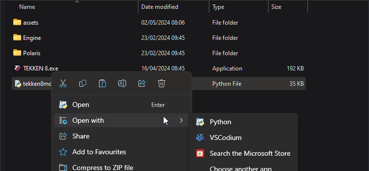

 

&nbsp;

&nbsp;

&nbsp;

# Index
1. [Description](#Description)
2. [Updates](#Latest_Update)
3. [How It Works](#How_It_Works)
4. [Instructions](#Installation)
5. [KnowIssues](#Know_Issues)
6. [FAQ](#FAQ)
7. [Credits](#Credits)

&nbsp;

## Description
An open sourced mod manager inspired by [CCDTreborn's 8 Mod On / Off Switch (Version 2)](https://tekkenmods.com/mod/3312/tekken-8-mod-on-off-switch-version-2)
to enable/disable your mods with a switch.

Source code: [https://github.com/opensource111111/tekken-8-mod-manager](https://github.com/opensource111111/tekken-8-mod-manager)

Program Manua: 
Any feedback, bugs or issues, please post in the comment section. Thank you. :)

&nbsp;

&nbsp;

&nbsp;

## Latest_Update

###  1st June 2024
1. Added a search bar to list view mode. Enable this option in the window configuration menu.
2. Added a application scale slide in the window configuration menu.
3. Remove the dock information panel option in window configuration menu. The Detail panel will be docked by default.

### 29th May 2024

1. Fixed an issue with mod.ini not being created when clicking the save button in the details panel.
2. A mod.ini file is created for new mods at start-up or by pressing the refresh list button.

###  27th May 2024

   1. Added a function for managing conflicting mods. [Document here](docs/how_to_conflict_mods.md)

   

   

   <video src="assets/screenshots/conflict/conflicts.mp4" width="800" height="400" controls></video>

Changelog History: https://github.com/opensource111111/tekken-8-mod-manager/blob/main/changelog.md

&nbsp;

&nbsp;

&nbsp;

## How_It_Works

- Searches for folders/subfolders inside "Steam\steamapps\common\Tekken 8\Polaris\Content\Paks" that have .pak files inside and then lists them inside the program to then be able to switch them on/off. 

- Recommended folders to create are ~mods , mods and logicmods. To keep things organized, I recommend to have a separate folders for each mod. By doing this you can turn on/off mods seperately but thats up to you.

   examples: 

   

  
- The program adds or removes "-x" at the end of each file (.utoc, .ucas, .pak) to enabled/disabled.
	
   - Enabled = Filenames not ending with "-x"
   - Disabled = Filenames ending with "-x"

&nbsp;

&nbsp;

&nbsp;

&nbsp;

&nbsp;

&nbsp;

## Installation
   
   ### Option 1: Run from executable. (Windows Only)

   1. Unzip the exe file from the zip file. You will most likely get a virus warning which will then quarantine the file. Any virus warning you may have are false positives. 

   2. Place the executable in "Steam\steamapps\common\Tekken 8" and run.
   
   
   

   Note: The Windows executable was compiled using pyinstaller.
      
        pyinstaller tekken8modmanager.spec

&nbsp;

  ### Option 2: Run from script (Windows / Linux)

      
   1.  Windows  -  Install Python 3.11.9: https://www.python.org/downloads/release/python-3119/
   2.  Linux  - Open Terminal / Windows - Open Windows command prompt
      
      Install required packages using these commands:

            - pip install pip
            - pip install glfw
            - pip install numpy
            - pip install PyOpenGL PyOpenGL_accelerate
            - pip install imgui
            - pip install pillow
         

   3. Place the "tekken8modmanager.py" script and "assets" folder inside "Steam\steamapps\common\Tekken 8".
     

   

   
    Windows  - Right click file to open the context menu and open with 
   Python.

   

    Linux  - Open the python terminal and type "python3". Drag and drop 
   the script onto the terminal and press enter.

      python3 path_to_script

&nbsp;

&nbsp;

&nbsp;

 # Known_Issues
 - 

&nbsp;

 # FAQ
 - 

&nbsp;

## Credits:

glfw:  https://pypi.org/project/glfw/

numpy: https://github.com/numpy/numpy

PyOpenGL: https://pypi.org/project/PyOpenGL/

imgui: https://pypi.org/project/imgui/

pillow: https://pypi.org/project/pillow/

TARGET FONT BY Iconian Fonts : https://www.fonts4free.net/tarrget-font.html#

