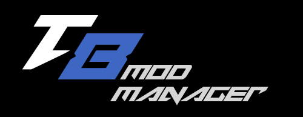
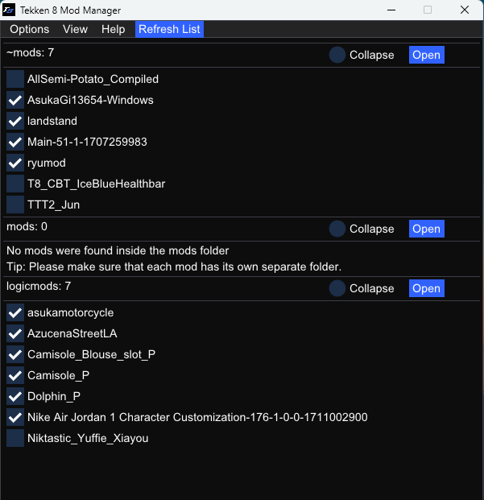
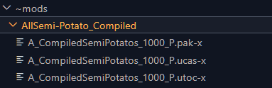
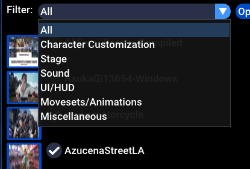
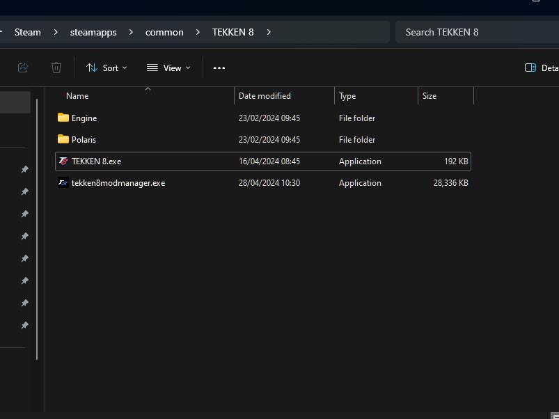
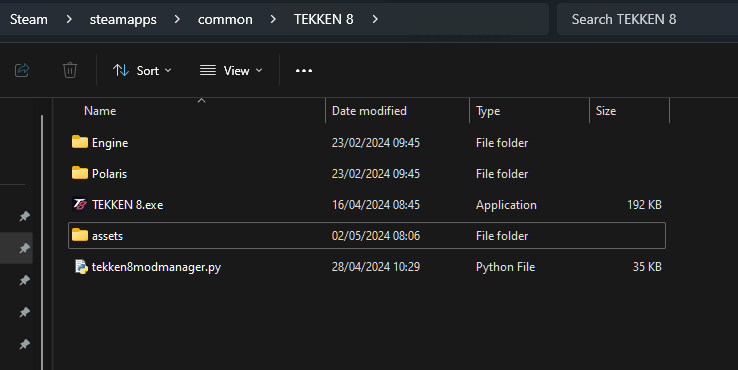

## Description
A mod manager Inpired by [CCDTreborn's 8 Mod On / Off Switch (Version 2)](https://tekkenmods.com/mod/3312/tekken-8-mod-on-off-switch-version-2)
to your mod turn on / off with a switch.

Source code: [https://github.com/opensource111111/tekken-8-mod-manager](https://github.com/opensource111111/tekken-8-mod-manager)

Any feedback, bugs or issues, please post in the comment section. Thank you.

#
#

## Updates

Changelog History: https://github.com/opensource111111/tekken-8-mod-manager/blob/main/changelog.md

  - ### 12th May 2024

1. Removed the ~mods, mods and logicmods folder requirement. The program will now search for any folder/subfolder inside the Pak folder that have .pak files inside them. 
   
 Please make sure that each mod has their own separate folder.
 

    

2. Added a category filter box at the top of the window to help organize your mod collection. 
   

         Available categories:
         - All
         - Character Customization
         - Stage
         - Sound
         - UI/HUD
         - Movesets/Animations
         - Miscellaneous

3. Added a details box/panel to show details of the mods such as name, auther etc which can be edited in the program. This will create an mod.ini at the location of the mod. The mod.ini can be created manually also.

   Example:

         [Mod]
         name= "T8"
         author= "John"
         description= "example"
         url= "www.example.com"
         category= "All"

4. Thumbnail supported file types: .jpg , .jpeg, .png, .webp, .bmp
 

#
#

## How it works.

- Searches for the folders/subfolders inside "Steam\steamapps\common\Tekken 8\Polaris\Content\Paks" that have .pak files inside and them lists them inside the program to be able to switch them on/off. 

- The program adds or removes "-x" at the end of each file (.utoc, .ucas, .pak) to enabled/disabled.
	
   - Enabled = Filenames not ending with "-x"
   - Disabled = Filenames ending with "-x"

#
#

## Install Instruction
   
   ### Option 1: Run from executable. (Windows Only)

   1. Unzip the exe file from the zip file. You will most likely get a virus warning which will then quarantine the file. Any virus warning you may have are false positives. 

   2. Place the executable in "Steam\steamapps\common\Tekken 8" and run.
   
   
   

   Note: The Windows executable was compiled using pyinstaller.
      
        pyinstaller tekken8modmanager.spec

#

  ### Option 2: Run from script (Windows / Linux)

      
   1.  Windows  -  Install Python 3.11.9: https://www.python.org/downloads/release/python-3119/
   2.  Linux  - Open Terminal / Windows - Open Windows command prompt
      
      Install required packages using these commands:

            - pip install pip
            - pip install glfw
            - pip install numpy
            - pip install PyOpenGL PyOpenGL_accelerate
            - pip install imgui[full]
            - pip install pillow
         

   3. Place the "tekken8modmanager.py" script and "assets" folder inside "Steam\steamapps\common\Tekken 8".
     

   

   
    Windows  - Right click file to open the context menu and open with 
   Python.

   

    Linux  - Open the python terminal and type "python3". Drag and drop 
   the script onto the terminal and press enter.

      python3 path_to_script

## Credits

TARGET FONT BY Iconian Fonts : https://www.fonts4free.net/tarrget-font.html#

