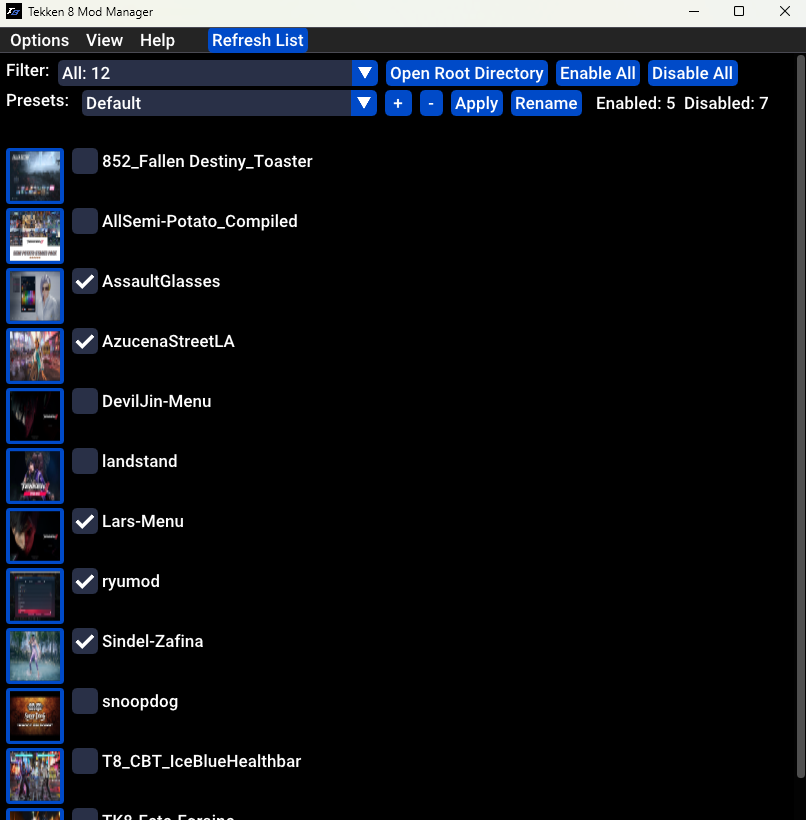

A Tekken 8 mod manager to turn on / off mods 

Source code: [https://github.com/opensource111111/tekken-8-mod-manager](https://github.com/opensource111111/tekken-8-mod-manager)

Inspired by CDDTreborn's Tekken 8 Mod On / Off Switch (Version 2) at https://tekkenmods.com/mod/3312/tekken-8-mod-on-off-switch-version-2

Font used in logo
TARGET FONT : https://www.fonts4free.net/tarrget-font.html#

# Updates

      14th April 2024
      - Added a list directory tree view mode. In this mode you can now enable or 
      disable from the top level folder or sub level folder. To switch viewing mode 
      click the View button on the top left corner and select Tree View from the drop menu.

      11th April 2024
      - Can now search for the folder "mods" inside "Steam\steamapps\common\Tekken 8\Polaris\Content\Paks"

      10th April 2024
      - Added a button to open ~mods and logicmods folders.
      - Change colour of UI titlebar.
      - Added an indent to the lists of mods under each folder.
      - Corrected a issue with paths using the python script under Linux.
      

      7th April 2024
         - Added a separator to the UI to show both ~mods and logicmods separately.

   

# How it works.
- Searches for folders ~mods and logicmods inside "Steam\steamapps\common\Tekken 8\Polaris\Content\Paks"
and lists every mod inside theses 2 folders. 

# Please make sure that each mod has it own separate folder or you will get an error.

example:

- The program adds or removes "-x" at the end of each file(.utoc, .ucas, .pak) to enabled/disabled.
	- Enabled = Filenames not ending with "-x"
	- Disabled = Filenames ending with "-x"

# Install Instruction
   
   ### Option 1: Run from executable. (Windows Only)
   1. Unzip the exe file from the zip file. You will most likely get a virus warning which will then quarantine the file. Any virus warning you may have are false positives. Place the executable in "Steam\steamapps\common\Tekken 8" and run.

   The Windows excutable was compiled using pyinstaller.

      pyinstaller --icon "assets\icon.ico" --onefile tekken8modmanager.py --add-binary "dep\glfw-3.4.bin.WIN64\lib-mingw-w64\glfw3.dll;." --noconsole   

  ### Option 2: Run from the script (Windows / Linux)

  Dependence
      - Windows users Install Python: https://www.python.org/
          
    Windows - Open Windows command prompt
    Linux - Open Terminal
      - pip install pip
      - pip install glfw
      - pip install numpy
      - pip install PyOpenGL PyOpenGL_accelerate
      - pip install imgui
      - pip install pillow
      
      
      
   1. Place the "tekken8modmanager.py" script in "Steam\steamapps\common\Tekken 8".

      Linux - Open the python terminal and type "python3". Drag and drop the script onto the terminal and press enter.

            python3 path_to_script

      Windows - Right click file to open the context menu and open with Python

