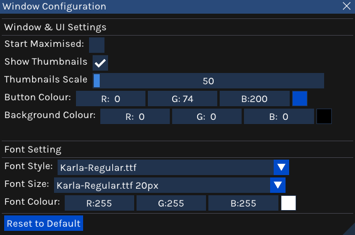
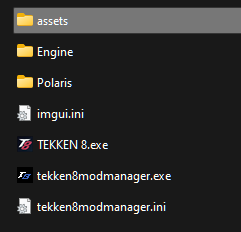
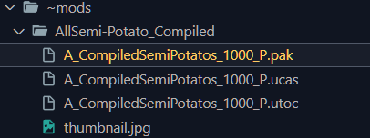
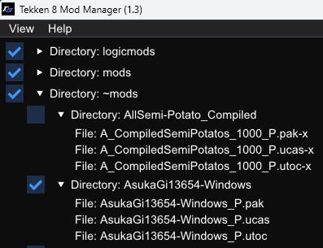

## ChangeLog

&nbsp;

Any feedback, bugs or issues, please post in the comment section. Thank you.

### 26th May 2024

1. Fixed an issue with the description format class causing errors while importing the mod list into the program.
2. Fixed division by 0 error while minimizing window.

### 20th May 2024

   1. Added enable/disable all buttons
   2. Add an enabled/disabled mod counter to the top of the ui. 
   3. Added the ability to create you own presets
   Enable multiple mods that are part of the presets you apply. 
   

   4. Switching between listview and treeview can be done instantly now. 
   5. Added a splash screen.

&nbsp;

&nbsp;

&nbsp;

### 12th May 2024

1. Removed the ~mods, mods and logicmods folder requirement. The program will now search for any folder/subfolder inside the Pak folder that have .pak files inside them. 
   
 Please make sure that each mod has their own separate folder.
 

    

2. Added a category filter box at the top of the window to help organize your mod collection. 

         Available categories:
         - All
         - Character Customization
         - Stage
         - Sound
         - UI/HUD
         - Movesets/Animations
         - Miscellaneous

3. Added a details box/panel to show details of the mods such as name, auther etc which can be edited in the program. This will create an mod.ini at the location of the mod. The mod.ini can be created manually also.

   Example:

         [Mod]
         name= "T8"
         author= "John"
         description= "example"
         url= "www.example.com"
         category= "All"

4. Thumbnail supported file types: .jpg , .jpeg, .png, .webp, .bmp
 

&nbsp;

&nbsp;

&nbsp;

#### 6th May 2024

   
   
   - Added a windows configuration menu. Will add onto this at a later date. Option > Windows Configuration:

      - Global Scale (Disabled for now)
      - Font Size
      - Font Style
      - Thumbnail Scale
      - Show Thumbnail
      - Start Maximised Window
      - Button Colour
      - Background Colour

   All setting will be saved in the "tekken8modmanager.ini". The file will be created in the same location as the program.
   

   

   Custom Fonts
   - You can add your own fonts by creating the folders "assets/fonts" in the same location as the program. Paste your font files in the folder "fonts". The font format have to be .ttf or .otf. 

  

&nbsp;

&nbsp;

&nbsp;

#### 3rd May 2024

   - Added the ability to save your viewmode setting. This will create a file called "tekken8modmanager.ini".

&nbsp;

&nbsp;

&nbsp;

#### 27th April 2024
   - Fixed aspect ratio on thumbnails when hovering over icon with the mouse curser.

&nbsp;

&nbsp;

&nbsp;

#### 17th April 2024

   

   - Cleaned up UI elements
   - Add a hide button for each folder.
   - Can now search for ~mods, logicmods or mods folders in lowercase or uppercase

   

   - (Experimental) Added thumbnail support. Only works in List view mode.  Click on the options tab and show thumbnail.  Place a image file  inside the mod folder of your choice and name it "thumbnail"(jpg, png) If no image is found then it will default to using the programs logo as the thumbnail. 
   -Fixed slow loading of thumbnails

&nbsp;

&nbsp;

&nbsp;

#### 14th April 2024

   

   - Added a list directory tree view mode. In this mode you can now enable or disable from the top level folder or sub level folder. To switch viewing mode click the View button on the top left corner and select Tree View from the drop menu.

&nbsp;

&nbsp;

&nbsp;

#### 11th April 2024
   - Can now search for the folder "mods" inside "Steam\steamapps\common\Tekken 8\Polaris\Content\Paks"

&nbsp;

&nbsp;

&nbsp;

#### 10th April 2024
   - Added a button to open mod folders.
   - Changed colour of UI titlebar.
   - Added an indent to the lists of mods under each section.
   - Corrected a issue with paths using the python script under Linux.  

   

&nbsp;

&nbsp;

&nbsp;

#### 7th April 2024
   - Added a separator to the UI to show both ~mods and logicmods separately.

   

