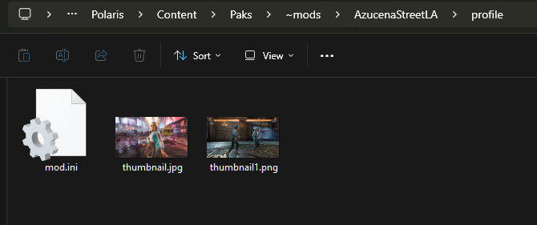
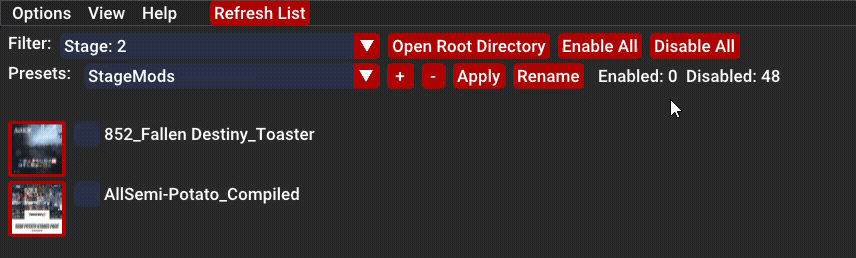

# Manual

### Index
1. [How It Works](#How_It_Works)
1. [Files and Folders](#Files_and_Folders)
2. [UI Overview](#UI_Overview)
3. [Managing Mod Conflicts In Tekken 8 Mod Manager](#Managing_Mod_Conflicts_In_Tekken_8_Mod_Manager)

&nbsp;

&nbsp;

### How_It_Works

- Searches for folders/subfolders inside "Steam\steamapps\common\Tekken 8\Polaris\Content\Paks" that have .pak files inside and then lists them inside the program to then be able to switch them on/off.

- The program adds or removes "-x" at the end of each file (.utoc, .ucas, .pak) to enabled/disabled.
	
   - Enabled = Filenames not ending with "-x"
   - Disabled = Filenames ending with "-x"

   
    

&nbsp;

### Files_and_Folders

    
- Recommended starting folders to create are ~mods, mods and logicmods. To keep things organized, I recommend to have a separate folders for each mod. By doing this you can turn on/off mods separately but that's up to you.

   examples: 

  

   - 1.1 - Inside a mod folder. The profile folder is created at startup or by pressing the refresh button on the mainmenu bar.
      

   - 1.2 - Inside a profile folder located inside each mod folder. Add your image files inside here. The file type(.png, .jpg/jpeg, .bmp, .webp). The image file can be named want ever you want.
   
   
   You add as many images as you want. In the detail panel hover over the image and use the scroll wheel to scroll through the images.
   
   

   
&nbsp;

   ### UI_Overview
    

   - 1.1. Window Configuration Menu.
   
   

   
&nbsp;

   - 1.2. View modes.
     - List - Enable/Disable individual mods in there separator folders 
     - Tree: Enable/Disable Individual mods including there sub folders.
      
      

   
&nbsp;

   - 1.3. About

      

   
&nbsp;

   - 1.4. Tool Bar
      
      

      - 1.4.1 - Filter
         

      - 1.4.2 - Presets

         - Overview
         

         - Rename Preset
         

         - Add Preset
          

         
   
&nbsp;

 
   

   - 1.5.  Details Panel
   
      

      
   

&nbsp;

   ### Managing_Mod_Conflicts_In_Tekken_8_Mod_Manager

   
   #### Purpose

   - To find conflicts between different enabled mods and notify the user.

   - It works by matching common strings values that are inputted into the "override parameter" text field in the description panel. You can add as many text fields as you want the describe your mod by click on the + button.

   - The strings values are not hard coded into the program, so you can type anything. I have put together recommendtion on how I use this but if you decide that the recommendation are not up to your liking then you can go by any format you want. Just make sure that the string values have no spaces.

      
      

   
&nbsp;

   #### Recommended Setup

         header::the-asset-being-replaced

   - Any spacing should use -.

   - Use in-game names for describing assets

   1. header - The area of the game you are replacing.

         - ui
         - sound
         - character-common (e.g for common items between characters)
         - character - character specific (e.g azucena::preset-1)
         - stage
         - avatar
         - others

   2. the-asset-being-replaced 

         - preset-name 
         - sound-name
         - character-custom-item-name
         - stage-name

   
&nbsp;

   #### Examples

   - common items (common item changes)

         character-common::eye-patch

   - character (character specific changes)

         zafina::tk8-style-(p1)

         zafina::tk7-style-(p1)

         zafina::astrologer's-earrings
         
         jack8::voice-sfx

   - ui (common game ui)

         ui::healthbar

         ui::mainmenu-character

   - sound (common game audio)

      - Anna Williams (Console ver.) / TEKKEN 3.

            sound::anna-williams-(console-ver.)-/-tekken3

   - stage (stage)
            
      - Fallen Destiny

            stage::fallen-destiny 

   - avatar

      - Ski Mask Panda

            avatar::ski-mask-panda

   - others
      - Remove SSS
      
               others::remove-sss

