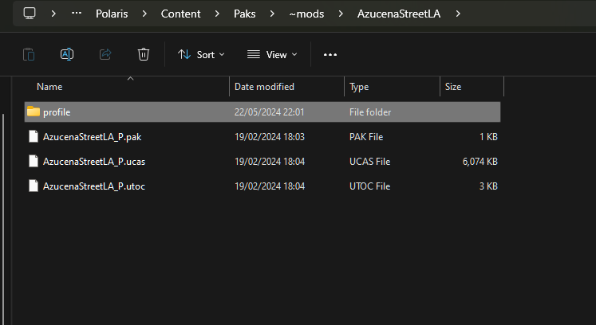
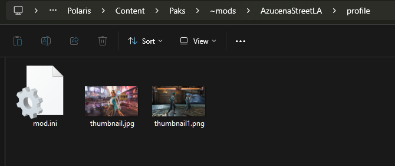
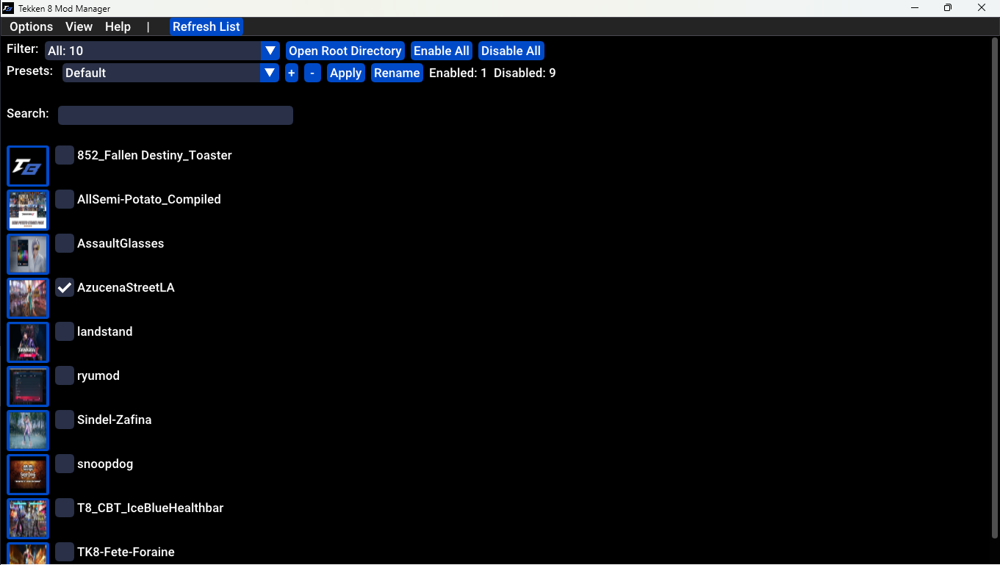
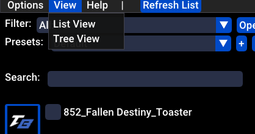
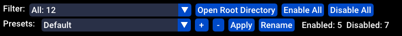
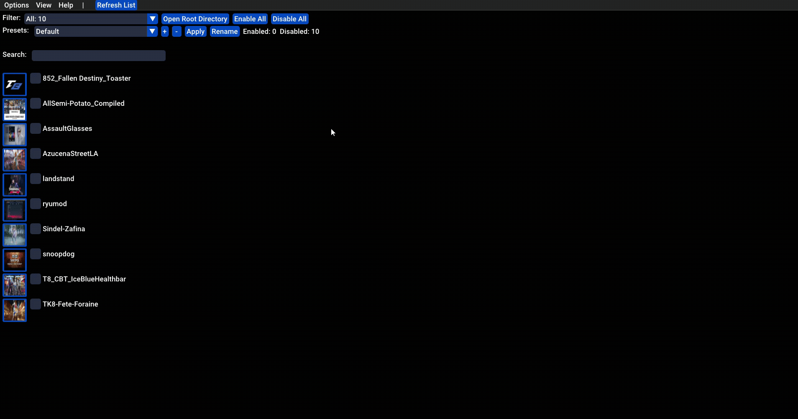
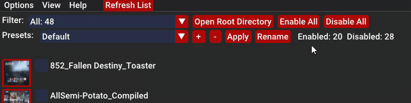
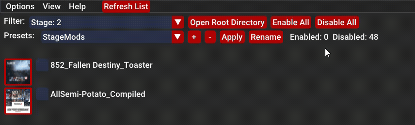
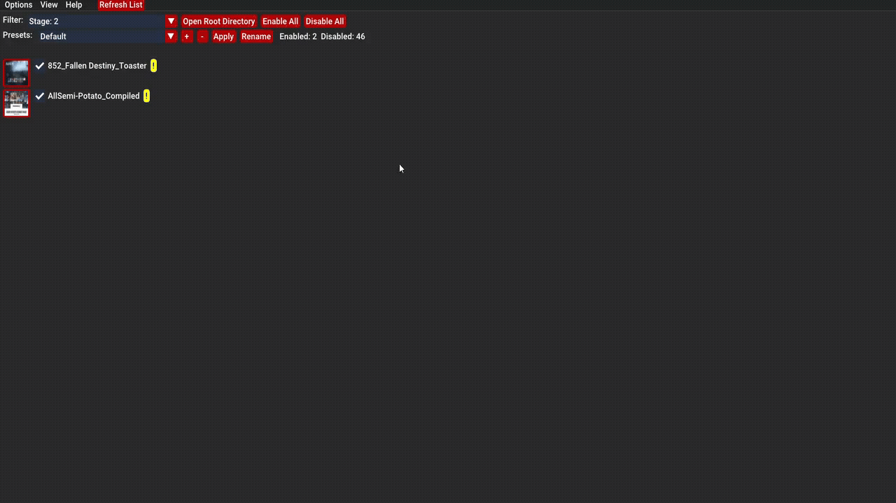

# Manual

   ### 1. Files and Folders

   - 1.1 - Inside a mod folder. The profile folder is created at startup or by pressing the refresh button on the mainmenu bar.
      

   - 1.2 - Inside a profile folder located inside each mod folder. Add your image files inside here. The file type(.png, .jpg/jpeg, .bmp, .webp). The image file can be named want ever you want. You add as many images as you want. In the detail panel hover over the image and use the scroll wheel to scroll through the images.
      

&nbsp;

   ### 2. UI Overview
   

   - 1.1. Window Configuration Menu.
   
   

&nbsp;

   - 1.2. View modes.
     - List - Enable/Disable individual mods in there separator folders 
     - Tree: Enable/Disable Individual mods including there sub folders.
      
      

 
&nbsp;

   - 1.3. About

      

 
&nbsp;

   - 1.4. Tool Bar
      
      

      - 1.4.1 - Filter
         

      - 1.4.2 - Presets

         - Overview
         

         - Rename Preset
         

         - Add Preset
          

      
 
&nbsp;

 
   

   - 1.5.  Details Panel
   
      

      
   

  
&nbsp;

